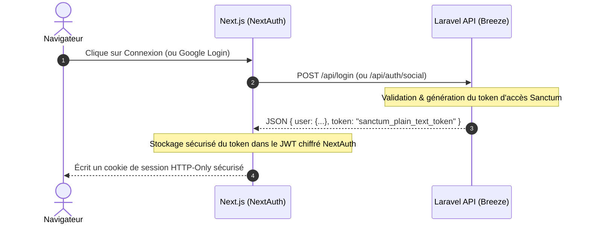

# 📚 Résumé Complet du Projet - TunisieBooking

Ce document sert de référence technique et de guide de démarrage pour vous permettre de travailler en toute autonomie sur le projet **TunisieBooking** en dehors de l'environnement Antigravity.

---

## 🏛️ 1. Architecture Globale

Le projet est structuré selon un modèle **Découplé (Client/Serveur)** :

```
┌─────────────────────────────────┐          JSON REST API          ┌─────────────────────────────────┐
│     Client Next.js (React)      │ ──────────────────────────────> │      Serveur Laravel (API)      │
│  (Port 3000 par défaut / Client) │ <────────────────────────────── │   (Port 8000 par défaut / DB)   │
└─────────────────────────────────┘      Sanctum Tokens / Auth      └─────────────────────────────────┘
```

- **Back-end (Laravel 11 / PHP 8.2+)** : Agit comme une API REST pure. Il gère l'accès aux données (MySQL), applique les règles métier, valide l'authentification et exécute les tests unitaires.
- **Front-end (Next.js 14+ / App Router)** : Fournit l'interface utilisateur moderne (React/TailwindCSS). Il interagit avec l'API pour afficher les offres, gérer les réservations et administrer le site.
- **Authentification Hybride** : Gérée sur le serveur par **Laravel Breeze** & **Sanctum** (avec support **Socialite** pour Google OAuth) et sur le client par **NextAuth.js** (sécurisation par Cookies HTTP-Only et JWT).

---

## 📁 2. Structure du Projet (Workspace)

```
stage20252026/
├── client/                      # --- FRONT-END NEXT.JS ---
│   ├── src/
│   │   ├── app/                 # Pages (App Router)
│   │   │   ├── admin/           # Dashboard et interfaces CRUD Admin
│   │   │   ├── api/auth/        # Configuration NextAuth.js
│   │   │   ├── destinations/    # Liste et détails des destinations
│   │   │   ├── hotels/          # Liste, filtres et détails des hôtels
│   │   │   ├── voyages/         # Liste et détails des voyages organisés
│   │   │   ├── login/           # Page de connexion
│   │   │   ├── register/        # Page d'inscription
│   │   │   ├── profil/          # Gestion du profil client
│   │   │   └── reservations/    # Liste des réservations client
│   │   ├── components/          # Composants réutilisables (Navbar, Footer, SearchBox...)
│   │   └── lib/                 # Utilitaires (utils.ts)
│   ├── package.json             # Dépendances Node.js (Next, React, Next-Auth)
│   └── tsconfig.json            # Configuration TypeScript
│
├── server/                      # --- BACK-END LARAVEL ---
│   ├── app/
│   │   ├── Console/Commands/    # Commandes Artisan d'import de données externes
│   │   ├── Http/Controllers/Api/# Contrôleurs API REST (Auth, Hôtels, Voyages...)
│   │   ├── Http/Controllers/Auth/# Contrôleurs Laravel Breeze (Login, Register, Mails)
│   │   └── Models/              # Modèles Eloquent & Règles métier (Reservation, Hotel, User...)
│   ├── config/                  # Configuration du serveur (Services, Auth, Database)
│   ├── database/
│   │   ├── migrations/          # Structure de la base de données MySQL
│   │   └── seeders/             # Données de démonstration (Seeders)
│   ├── routes/
│   │   ├── api.php              # Définition des routes de l'API REST
│   │   └── web.php              # Routes web basiques
│   ├── tests/
│   │   └── Unit/                # Tests unitaires rapides (sans base de données)
│   ├── composer.json            # Dépendances PHP (Laravel, Breeze, Socialite, Sanctum)
│   └── phpunit.xml              # Configuration de la suite de tests PHPUnit
│
└── PROJECT_SUMMARY.md           # Ce fichier de référence
```

---

## 🗄️ 3. Base de Données (Modèles & Relations)

Le schéma relationnel MySQL contient les tables et modèles Eloquent suivants :

### 3.1 Liste des Modèles et Tables

1. **`User`** (`users`) : Gère les comptes.
   - *Champs* : `id`, `nom`, `prenom`, `email`, `telephone`, `role` (admin/client), `photo` (URL de l'avatar), `password`, `email_verified_at`, `remember_token`.
   - *Relations* : `hasMany(Reservation)`.
2. **`Destination`** (`destinations`) : Régions phares (Hammamet, Djerba, etc.).
   - *Champs* : `id`, `nom`, `region`, `image` (URL).
   - *Relations* : `hasMany(Hotel)`.
3. **`Hotel`** (`hotels`) : Hôtels disponibles pour réservation.
   - *Champs* : `id`, `destination_id`, `nom`, `description`, `adresse`, `etoiles` (1 à 5), `prix_base`, `image` (URL principale).
   - *Relations* : `belongsTo(Destination)`, `hasMany(Chambre)`, `hasMany(HotelPhoto)`, `belongsToMany(Service)`.
4. **`Chambre`** (`chambres`) : Types de chambres pour chaque hôtel.
   - *Champs* : `id`, `hotel_id`, `type` (single, double, triple, suite), `description`, `prix_supplement` (ajouté au prix de base), `capacite` (max adultes).
   - *Relations* : `belongsTo(Hotel)`.
5. **`Pension`** (`pensions`) : Options de repas.
   - *Champs* : `id`, `type` (Logement Simple, Petit Déjeuner, Demi-Pension, Pension Complète, All Inclusive), `description`.
   - *Relations* : `belongsToMany(Chambre)`.
6. **`Service`** (`services`) : Équipements de l'hôtel (Wifi, Piscine, Spa, etc.).
   - *Champs* : `id`, `nom`, `icone` (nom de classe ou SVG).
   - *Relations* : `belongsToMany(Hotel)`.
7. **`HotelPhoto`** (`hotel_photos`) : Galerie de photos secondaires.
   - *Champs* : `id`, `hotel_id`, `url_photo`.
   - *Relations* : `belongsTo(Hotel)`.
8. **`Voyage`** (`voyages`) : Voyages organisés à l'étranger.
   - *Champs* : `id`, `nom`, `pays`, `description`, `prix`, `image`, `date_depart`, `date_retour`.
   - *Relations* : `hasMany(Reservation)`.
9. **`Reservation`** (`reservations`) : Réservations de type "Hotel" ou "Voyage".
   - *Champs* : `id`, `user_id`, `hotel_id` (null si voyage), `chambre_id` (null si voyage), `pension_id` (null si voyage), `voyage_id` (null si hôtel), `type_reservation` (hotel/voyage), `date_debut`, `date_fin`, `nb_chambres`, `nb_adultes`, `nb_enfants`, `prix_total`, `statut` (en_attente, confirmee, annulee), `telephone`, `email_contact`, `nom_contact`, `prenom_contact`.
   - *Relations* : `belongsTo(User)`, `belongsTo(Hotel)`, `belongsTo(Chambre)`, `belongsTo(Pension)`, `belongsTo(Voyage)`.

---

## 🛣️ 4. API Endpoints (`server/routes/api.php`)

L'API est structurée en 3 niveaux d'accès :

### 4.1 Routes Publiques
- **Authentification** :
  - `POST /api/register` : Créer un compte client (Throttled: 3 tentatives/min).
  - `POST /api/login` : Se connecter et générer un token Sanctum (Throttled: 5 tentatives/min).
  - `POST /api/forgot-password` : Envoyer un e-mail de réinitialisation.
  - `POST /api/reset-password` : Enregistrer un nouveau mot de passe.
  - `POST /api/auth/social` : Login social OAuth via Google (Socialite).
- **Consultation** :
  - `GET /api/destinations` & `GET /api/destinations/{id}`
  - `GET /api/hotels` & `GET /api/hotels/{id}` (supporte le filtrage par `destination_id`, `etoiles`, `prix_max`).
  - `GET /api/voyages` & `GET /api/voyages/{id}`

### 4.2 Routes Protégées (Middleware `auth:sanctum`)
Accessibles à tout utilisateur connecté :
- `GET /api/me` : Obtenir les infos du profil connecté.
- `PUT /api/me` : Modifier les informations personnelles (nom, prenom, telephone).
- `PUT /api/me/password` : Modifier le mot de passe actuel.
- `POST /api/me/photo` : Mettre à jour l'avatar/photo de profil.
- `POST /api/logout` : Supprimer le token d'accès actuel.
- `POST /api/reservations` : Créer une réservation (Hôtel ou Voyage).
- `GET /api/mes-reservations` : Consulter ses propres réservations.

### 4.3 Routes Administrateur (Middlewares `auth:sanctum` + `admin`)
Permissions complètes sur les ressources (CRUD) :
- **Destinations** : `POST /api/destinations`, `POST /api/destinations/{id}` (mise à jour/upload), `DELETE /api/destinations/{id}`
- **Hôtels** : `POST /api/hotels`, `POST /api/hotels/{id}`, `DELETE /api/hotels/{id}`
- **Voyages** : `POST /api/voyages`, `POST /api/voyages/{id}`, `DELETE /api/voyages/{id}`
- **Réservations** : `GET /api/reservations` (toutes les réservations), `GET /api/reservations/{id}`, `PUT /api/reservations/{id}`, `DELETE /api/reservations/{id}`
- **Utilisateurs** : `GET /api/users`, `GET /api/users/{id}`, `PUT /api/users/{id}/role`, `DELETE /api/users/{id}`

---

## 🔐 5. Architecture d'Authentification (Breeze + NextAuth.js)

L'intégration de la sécurité se fait par pont entre Laravel Breeze et NextAuth.js :



### Points clés :
- **Token Sanctum** : Retourné sous forme de chaîne de caractères lors du login, stocké côté serveur Next.js dans la session cryptée, et injecté dans les en-têtes d'autorisation HTTP (`Authorization: Bearer <token>`) à chaque requête vers le back-end.
- **Rôles utilisateurs** : Le rôle (`client` ou `admin`) est présent dans le token JWT de NextAuth. Le fichier `client/src/app/admin/layout.tsx` l'intercepte côté serveur de Next pour bloquer les utilisateurs non autorisés avant même de charger la page.

---

## 💻 6. Interface Frontend Next.js

Le dossier `client/` implémente les interfaces clés suivantes :

### 6.1 Espace Client & Pages Publiques
- **Home (`src/app/page.tsx`)** : Barre de recherche avancée (`SearchBoxAdvanced`), grille des destinations populaires et slider des voyages organisés.
- **Filtres Hôtels (`src/app/hotels/page.tsx`)** : Formulaire interactif (`HotelsFilterForm`) de recherche par prix, étoiles et destination avec rendu en temps réel.
- **Tunnel de réservation** : Pages de détails affichant les formulaires de calcul dynamique des nuits, choix des chambres et options de pension.
- **Profil (`src/app/profil/page.tsx`)** : Modification des coordonnées et téléchargement direct de l'avatar.
- **Mes Réservations (`src/app/reservations/page.tsx`)** : Historique et statuts des commandes client.

### 6.2 Espace Administration (`src/app/admin/`)
Protégé par rôle, il intègre un dashboard affichant les statistiques globales ainsi que des tableaux de gestion CRUD interactifs :
- `/admin/destinations` : Création et modification de destinations (avec gestion d'upload de fichiers).
- `/admin/hotels` : Gestion des hôtels, attribution des chambres et des services.
- `/admin/voyages` : Publication et modification des voyages.
- `/admin/reservations` : Suivi global des réservations et validation des statuts (`confirmee` / `annulee`).
- `/admin/users` : Gestion des comptes et attribution du rôle `admin`.

---

## 🧪 7. Logique Métier & Tests Unitaires

### 7.1 Règles Métier majeures (`server/app/Models/Reservation.php`)
- **Calcul du nombre de nuits** :
  ```php
  public function getNbNuits(): int {
      $debut = new \DateTime($this->date_debut);
      $fin = new \DateTime($this->date_fin);
      $diff = $debut->diff($fin);
      return $diff->invert ? 0 : $diff->days;
  }
  ```
- **Calcul automatique du prix total** :
  ```php
  public function calculatePrixTotal(float $prixParNuit): float {
      return $prixParNuit * $this->getNbNuits() * ($this->nb_chambres ?? 1);
  }
  ```
- **Cycle de vie d'une réservation** (Transitions d'états autorisées) :
  - États valides : `en_attente`, `confirmee`, `annulee`.
  - Règle de transition : Une réservation au statut `annulee` ne peut plus être modifiée (état terminal).

### 7.2 Tests PHPUnit (`server/tests/Unit/`)
Les tests sont écrits sous forme de **tests unitaires purs (sans base de données)** pour s'exécuter instantanément (~1 seconde pour la totalité des tests). Ils utilisent `setRawAttributes()` pour instancier des modèles en mémoire :
```php
private function makeReservation(array $attributs): Reservation {
    $reservation = new Reservation();
    $reservation->setRawAttributes($attributs);
    return $reservation;
}
```

---

## 🛠️ 8. Commandes et Instructions pour travailler en dehors d'Antigravity

Pour lancer et développer sur l'application en local :

### 8.1 Configuration Initiale

1. **Back-end (Laravel)** :
   ```bash
   cd server
   cp .env.example .env
   composer install
   php artisan key:generate
   ```
   *Configurez vos accès DB MySQL dans le fichier `.env` (`DB_DATABASE`, `DB_USERNAME`, `DB_PASSWORD`).*

2. **Front-end (Next.js)** :
   ```bash
   cd client
   cp .env.local.example .env.local  # si existant, ou créez-en un
   npm install
   ```

### 8.2 Base de données & Alimentation

1. **Exécuter les migrations et injecter les données de test** :
   ```bash
   cd server
   php artisan migrate:fresh --seed
   ```
   *Crée les tables et injecte les utilisateurs par défaut (dont l'administrateur `admin@tunisiebooking.com` / `password`).*

2. **Lancer les commandes Artisan de collecte/scrapie de données** :
   ```bash
   php artisan app:fetch-hotels   # Importe les hôtels en DB
   php artisan app:fetch-voyages  # Importe les voyages organisés en DB
   ```

### 8.3 Lancement des Serveurs

Dans deux terminaux séparés :
- **Lancer le Back-end** (Port `8000`) :
  ```bash
  cd server
  php artisan serve
  ```
- **Lancer le Front-end** (Port `3000`) :
  ```bash
  cd client
  npm run dev
  ```

### 8.4 Exécuter la suite de tests

Pour vérifier l'intégrité de l'application et de la logique métier :
```bash
cd server
vendor/bin/phpunit
```
Pour lancer uniquement les tests unitaires avec un formatage clair :
```bash
vendor/bin/phpunit --testsuite Unit --testdox
```
