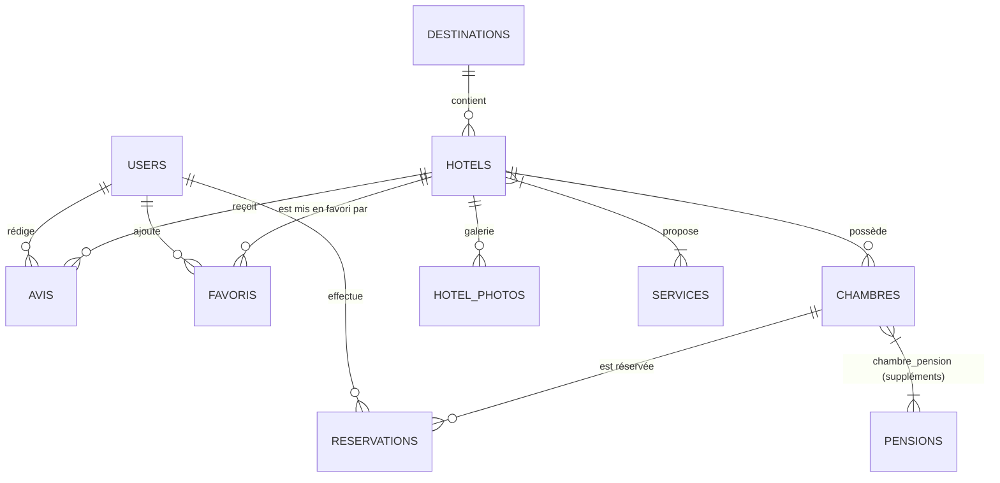

# 📌 RÉCAPITULATIF COMPLET DU PROJET - TUNISIEBOOKING

> **Note pour l'IA suivante / Rapport Technique de Synthèse**  
> Ce document synthétise l'intégralité du projet **TunisieBooking**, des modèles de données jusqu'à la logique d'automatisation n8n, l'interface client & administration et la suite de tests automatisés.

---

## 1. 🛠️ ARCHITECTURE TECHNIQUE & STACK

| Couche | Technologie | Rôle / Description |
|---|---|---|
| **Backend API** | **Laravel 11 / PHP 8.2+** | API RESTful sécurisée par Sanctum |
| **Base de données** | **MySQL / SQLite** | Schéma relationnel complet géré par migrations |
| **Frontend Client & Admin** | **Next.js 16 (App Router)** | UI fluide avec TypeScript, SSR/Client Components |
| **Styling** | **Vanilla CSS + Tailwind CSS** | Cartes interactives, animations et système de Toasts |
| **Automatisation** | **n8n (Webhooks HTTP)** | Envoi d'emails transactionnels automatique via Gmail API |
| **Tests** | **PHPUnit (78 tests)** | 100% de tests validés (Unitaires et d'Intégration) |

---

## 2. 🗄️ BASE DE DONNÉES & STRUCTURE DES MODÈLES (13 MODÈLES)


```mermaid
erDiagram
    USERS ||--o{ RESERVATIONS : "effectue"
    USERS ||--o{ AVIS : "rédige"
    USERS ||--o{ FAVORIS : "ajoute"
    HOTELS ||--o{ FAVORIS : "est mis en favori par"
    DESTINATIONS ||--o{ HOTELS : "contient"
    HOTELS ||--o{ CHAMBRES : "possède"
    HOTELS ||--o{ AVIS : "reçoit"
    HOTELS ||--o{ HOTEL_PHOTOS : "galerie"
    HOTELS }|--|{ SERVICES : "propose"
    CHAMBRES }|--|{ PENSIONS : "chambre_pension (suppléments)"
    CHAMBRES ||--o{ RESERVATIONS : "est réservée"
```

### 📋 Détail des Tables
1. **`users`** : `id`, `nom`, `prenom`, `email`, `password`, `telephone`, `photo`, `role` (`client` / `admin`).
2. **`destinations`** : `id`, `nom` (ex: Hammamet, Djerba), `region`, `image`.
3. **`hotels`** : `id`, `nom`, `description`, `etoiles` (1 à 5), `prix_par_nuit`, `destination_id`, `image`, `tarification_enfants` (JSON).
4. **`chambres`** : `id`, `hotel_id`, `type`, `nom`, `prix_base_nuit`, `capacite_adultes`, `capacite_enfants`, `quantite` (stock), `remise`.
5. **`pensions`** : `id`, `nom` (`Logement Seul`, `Petit Déjeuner`, `Demi-Pension`, `Pension Complète`, `All Inclusive`).
6. **`chambre_pension` (Pivot)** : `chambre_id`, `pension_id`, `supplement_prix` (Prix du supplément en DT/nuit par chambre).
7. **`services` / `hotel_service`** : Équipements de l'hôtel (Wifi, Piscine, Spa, Plage, etc.).
8. **`hotel_photos`** : Galerie photo additionnelle de l'hôtel.
9. **`voyages`** : Voyages organisés à l'étranger (`nom`, `pays`, `prix`, `duree_jours`).
10. **`reservations`** : `id`, `user_id`, `hotel_id`, `chambre_id`, `pension_id`, `date_arrivee`, `date_depart`, `nb_adultes`, `nb_enfants`, `ages_enfants`, `quantite_chambres`, `prix_total`, `statut` (`en attente`, `confirmee`, `annulee`).
11. **`avis`** : `user_id`, `hotel_id`, `note` (1-5), `commentaire`.
12. **`favoris`** : `user_id`, `hotel_id` (Système de Cœur ❤️).

---

## 3. ⚙️ LOGIQUE MÉTIER & CALCULS AUTOMATIQUES

### 💰 Calcul Dynamique du Prix de Réservation
$$\text{Prix Total} = \Big[ \big(\text{Prix Base Chambre} + \text{Supplément Pension Chambre}\big) \times \text{Quantité Chambres} + \text{Supplément Enfants}\Big] \times \text{Nombre de Nuits}$$

### 📦 Gestion du Stock de Chambres
- **Réservation créée** : Le nombre de chambres réservées est automatiquement déduit du stock disponible (`chambres.quantite`).
- **Annulation / Suppression** : Le stock est automatiquement remboursé et réincrémenté dans la table `chambres`.

---

## 4. 🤖 AUTOMATISATION N8N & EMAILS TRANSACTIONNELS

L'application envoie des Webhooks JSON vers n8n qui les transforme en emails avec le nœud Gmail API :

1. **Workflow 1 : Confirmation de Réservation (`POST /webhook/nouvelle-reservation`)**
   - Déclenché à la réservation d'un client.
   - Envoie un récapitulatif détaillé au client.

2. **Workflow 2 : Notification de Changement de Statut / Suppression (`POST /webhook/statut-reservation`)**
   - Déclenché quand l'admin **Confirme**, **Annule** ou **Supprime** une réservation.
   - Transmet l'action (`confirmation`, `annulation`, `suppression`) et envoie un email d'information au client.

---

## 5. 💻 EXPÉRIENCE UTILISATEUR & INTERFACES (NEXT.JS)

- **Cœur Favori ❤️** : Composant `HeartButton.tsx` intégré sur la page d'accueil, la recherche d'hôtels, la fiche détaillée et la page dédiée `/favoris`.
- **Éditeur de Tarifs Admin (`/admin/hotels/[id]/edit`)** : Permet à l'administrateur de fixer le prix de base de chaque chambre et le supplément exact pour chaque type de pension (Petit Déjeuner, Demi-Pension, All Inclusive, etc.).
- **Notifications Toast** : Pop-up volantes professionnelles animées en bas à droite pour remplacer les `alert()` système du navigateur.

---

## 6. 🧪 SUITE DE TESTS AUTOMATISÉS (78/78 PASS)

Toutes les routes API, authentification, calculs de prix, décrémentation/remboursement de stock et favoris sont couverts par **78 tests PHPUnit validés à 100%**.

---

## 7. 📊 RAPPORT EXCEL DES TESTS & BASE DE DONNÉES (`rapport-tests.xlsx`)

Un script automatisé Node.js permet de générer un rapport Excel complet croisant la vérité Terrain de la Base de Données, l'API REST et les résultats réels de PHPUnit.

### 🔹 1. Comment le fichier Excel a été créé ?
Le rapport est généré par le script [`reports/generate-report.js`](file:///c:/Users/User/Desktop/stage20252026/reports/generate-report.js) (ou `generate-excel-report.js`) à l'aide des bibliothèques `exceljs` et `xlsx`.

**Processus automatique en 4 étapes** :
1. **Extraction de la Base de Données** : Exécution de `php get-db-details.php` pour extraire l'état réel des tables `hotels`, `chambres`, `pensions`.
2. **Interrogation de l'API REST** : Envoi de requêtes HTTP GET sur `http://127.0.0.1:8000/api/...` via `axios` pour comparer ce que l'API renvoie vs la DB.
3. **Exécution de PHPUnit** : Lancement de `php artisan test --log-junit` pour générer un fichier XML de résultats réels.
4. **Génération Excel** : Structuration de plusieurs onglets (`Hôtels`, `Chambres`, `Pensions`, `Tests Unitaires`) avec mise en forme sous forme de tableau stylisé et sauvegarde dans `reports/rapport-tests.xlsx`.

---

### 🔹 2. Comment ouvrir le fichier Excel ?
Le fichier généré est situé à : `reports/rapport-tests.xlsx` (et sa version CSV `reports/rapport-tests.csv`).

Vous pouvez l'ouvrir avec :
- **Microsoft Excel**
- **LibreOffice Calc** / **OpenOffice**
- **Google Sheets** (en l'important dans Google Drive)
- L'extension VS Code **Excel Viewer** / **Office Viewer**.

---

### 🔹 3. Comment mettre à jour le fichier Excel ?
1. Démarrer le serveur Laravel :
   ```bash
   cd server
   php artisan serve
   ```
2. Lancer le script de génération Excel (dans un terminal à la racine) :
   ```bash
   node reports/generate-report.js
   ```
⚠️ **Remarque** : Si le fichier `rapport-tests.xlsx` est ouvert dans Microsoft Excel, fermez-le avant d'exécuter la commande pour éviter l'erreur de fichier verrouillé `EBUSY`.
