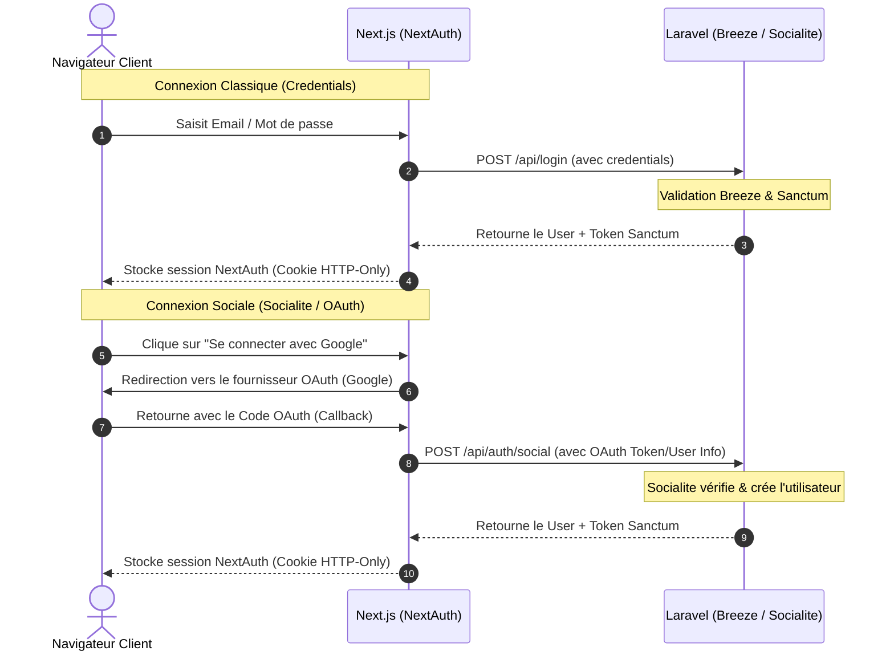

# Remplacement de l'authentification existante par Laravel Breeze, Socialite et NextAuth.js

Ce plan décrit l'implémentation de la nouvelle architecture d'authentification pour l'application TunisieBooking. Nous allons remplacer le système d'authentification actuel par :
- **Laravel Breeze** (API Stack) sur le back-end Laravel pour standardiser l'auth par mot de passe et l'envoi de mails de réinitialisation.
- **Laravel Socialite** sur le back-end pour le support de la connexion par réseaux sociaux (Google, Facebook, etc.).
- **NextAuth.js** (Auth.js) sur le front-end Next.js pour sécuriser la session utilisateur côté serveur et client à l'aide de cookies HTTP-Only et JWT.

---

## 🎯 Architecture Technique proposée



---

## 🛠️ Modifications Proposées

### 1. Back-end Laravel (`server/`)

#### 📦 [MODIFY] [composer.json](file:///c:/Users/User/Desktop/stage20252026/server/composer.json)
- Ajouter `laravel/breeze` (dev dependency) et `laravel/socialite` (prod dependency).

#### ⚙️ Installation de Breeze API
Exécuter la commande :
```bash
composer require laravel/breeze --dev
php artisan breeze:install api
```
Cela va créer automatiquement :
- Les contrôleurs d'auth standardisés sous `app/Http/Controllers/Auth/`.
- Les fichiers de requêtes de validation (ex: `LoginRequest`).
- Le fichier de routes `routes/auth.php`.

#### 🔧 Adaptation des Contrôleurs Breeze
Par défaut, Breeze API utilise des sessions basées sur les cookies de session. Pour le coupler avec NextAuth, nous adapterons les contrôleurs générés par Breeze pour :
1. Retourner le token Sanctum lors du Login et Register (comme votre contrôleur actuel mais en utilisant le moteur de Breeze).
2. Prendre en compte les colonnes personnalisées de votre table `users` (`nom`, `prenom`, `telephone`, `photo`, `role`).

#### 🌐 [NEW] Contrôleur Social Auth (`SocialAuthController.php`)
Créer un contrôleur pour gérer le login social via Socialite :
- Endpoint `POST /api/auth/social` : Reçoit les détails de l'utilisateur authentifié via NextAuth et génère un jeton Sanctum après création/récupération du compte en BDD.

#### 🛣️ [MODIFY] [api.php](file:///c:/Users/User/Desktop/stage20252026/server/routes/api.php)
- Remplacer les routes personnalisées actuelles d'auth par les routes fournies par Breeze.
- Ajouter la route `/api/auth/social` pour Socialite.
- Supprimer [AuthController.php](file:///c:/Users/User/Desktop/stage20252026/server/app/Http/Controllers/Api/AuthController.php) et [PasswordResetController.php](file:///c:/Users/User/Desktop/stage20252026/server/app/Http/Controllers/Api/PasswordResetController.php) devenus obsolètes.

---

### 2. Front-end Next.js (`client/`)

#### 📦 [MODIFY] [package.json](file:///c:/Users/User/Desktop/stage20252026/client/package.json)
- Installer `next-auth` (v4 ou v5 compatible avec React 19).

#### ⚙️ Configuration de NextAuth
Créer le fichier de configuration de session :
- [NEW] `client/src/app/api/auth/[...nextauth]/route.ts`
- Définir le `CredentialsProvider` qui appelle l'API Laravel Breeze `/api/login` pour valider l'utilisateur et obtenir le token Sanctum.
- Définir les providers OAuth (ex: `GoogleProvider`) pour le login social.
- Enregistrer le token Sanctum et le rôle utilisateur dans le JWT et la session NextAuth.

#### 👥 Mise à jour des Pages et Composants d'Auth
- **Login / Register** : Utiliser la fonction `signIn()` de NextAuth.
- **Navbar & Logout** : Remplacer l'état local / `localStorage` et le custom event par la session NextAuth via le hook `useSession()` de NextAuth et la fonction `signOut()`.
- **ConditionalMain & Layouts** : Utiliser `useSession()` ou le middleware NextAuth pour restreindre l'accès aux pages Admin côté serveur et côté client. Plus besoin de lire le localStorage non sécurisé !

---

## 🧪 Plan de Vérification

### Tests Automatisés
- Exécuter la suite de tests PHPUnit existante (`vendor/bin/phpunit`) et adapter les tests d'intégration d'auth pour utiliser les nouveaux endpoints de Breeze si nécessaire.

### Vérification Manuelle
1. Inscription d'un nouveau compte client.
2. Connexion avec les identifiants.
3. Vérification que les pages d'administration restent inaccessibles aux clients.
4. Déconnexion et vérification de la mise à jour immédiate de la Navbar.
5. (Optionnel) Test du flux de connexion avec Google si configuré avec des clés de test.
